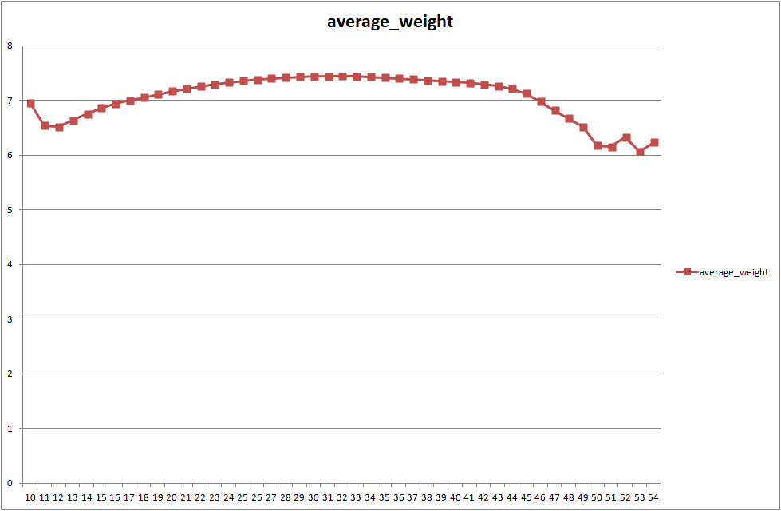

# 구글 빅쿼리 활용

- 본 챕터에서는 빅쿼리 결과를 구글 앱엔진과 연동해 미국의  각 지역 별 임신기간과 임신건수를 나눈 평균 임신기간 정보를 제공하는 사이트를 구축할 수 있음
- 이를 위해 다음과 같은 기능들에 대해 다룰 예정:

> - 엑셀과 빅쿼리 연동 방법
> - 구글 앱엔진을 사용한 사이트  생성
> - 구글 빅쿼리와 앱엔진 연동 방법
> - 구글 차트와 빅쿼리 결과 연동 방법

## 1. BigQuery Connector for Excel

- 가장 일반적이고 강력한 엑셀과 빅쿼리 연동이 가능하며, 3단계를 걸쳐 빅쿼리-엑셀 커넥터를 활용한 데이터 분석 수행 가능:

> 1. 빅쿼리-엑셀 커넥터 인증: GCP 내에서 인증 진행 가능
> 2. 엑셀 환경 설정: IQY 파일로 GCP와 연동 가능케 함
> 3. 엑셀에서 빅쿼리-엑셀 커넥터 사용
>
> 참조. <https://bigquery-connector.appspot.com/>

### 1) 빅쿼리-엑셀 커넥터 인증

- 위의 참조페이지에서 커넥터를 사용할 구글 계정 정보를 확인하고, 인증 키를 발급 받을 수 있음
- 발급받은 키는 별로도 보관하여 사용이 가능하나, 보안상의 이슈로 가급적 짧게 사용하고 사용 후에는 revoke 하기를 권고

 ### 2) 엑셀 환경 설정

- 엑셀에서 빅쿼리에 접속하기 위해서는 IQY 파일이 필요
- IQY 파일은 특정 URL로 쿼리를 작성하는 템플릿 파일이며, 변수로 '쿼리 내용', '프로젝트 아이디', '인증 키'를 받아 구글 빅쿼리에 데이터를 요청

### 3) 엑셀에서 빅쿼리-엑셀 커넥터 사용

- 엑셀 셀 안에 위의 IQY 파일 변수들을 준비
- 준비가 완료되면 **데이터 > 외부 데이터 가져오기 > 기존 연결**에서 IQY 파일 선택하여 빅쿼리에 데이터를 요청하는 것이 가능 (준비한 IQY 연결파일은 미리 관련 디렉토리에 세팅)

### 참조) 데이터 표현 - [엑셀파일](빅쿼리-엑셀 커넥터.xlsx)

- 위의 과정에 따라 다음과 같은 쿼리 실행:

  ```sql
  SELECT 
    mother_age, sum(weight_pounds) as total_weight
  FROM
    `bigquery-public-data.samples.natality`
  GROUP BY
    mother_age 
  ORDER BY
    mother_age
  ```

- 쿼리 결과 산모의 나이 별 신생아의 평균 몸무게 데이터를 추출할 수 있고, 엑셀 차트로 표현하면 아래와 같음:



> - 13세 이후부터 33세까지는 산모의 나이가 증가함에 따라 신생아의 몸무게가 증가
> - 산모의 나이가 33세를 넘어가면서부터 신생아의 몸무게가 줄기 시작하여 48세 이후의 경우 6파운드 초반의 신생아 탄생
> - 가장젊은 산모는 10세이고, 가장 늙은 산모는 54세


