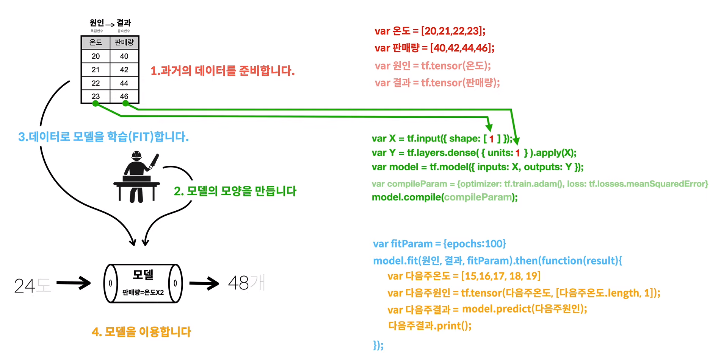

# 02. 모델 학습하기

### 1. 모델 학습 과정

- 모델의 학습 과정은 크게 다음 세단계를 거침:

  

  > 가. 과거의 데이터 준비
  >
  > 나. 모델의 구조 설계
  >
  > 다. 데이터로 모델 학습을 진행
  
- 모델링에 앞서 다음 `<script>`를 통해 라이브러리를 호출:

  ```html
  <script src="https://cdn.jsdelivr.net/npm/@tensorflow/tfjs@1.0.0/dist/tf.min.js"></script>
  ```

- 결과는 브라우저의 console 탭에서 확인 가능

### 2. 과거 데이터 준비

- 과거 데이터는 **array()를 `tf.tensor()`**에 입력하여 준비
- 위의 예제를 보면 `온도`와 `판매량` 변수에 array를 담고, 해당 array를 `tf.tensor()`에 담아 `원인`과 `결과` 변수를 생성
- 최종적으로 사용되는 변수는 **독립변수**로 **`원인`**을, **종속변수**로 **`결과`**를 사용

### 3. 모델의 구조 설계

- 모델의 구조는 1) 레이어를 생성하는 과정과, 2) 각각의 레이어를 모델로 연결하는 과정, 그리고 3) 파라미터로 모델을 컴파일링 하는 과정을 거쳐 설계

- 단층 모델을 만든다고 가정할 때, 레이어는 **입력**레이어와 **출력**레이어로 구성하게 됨:

  > - 입력레이어는 아래와 같이 변수로 할당하며, 이때 차원 수(feature 수)를 `shape` 파라미터에 지정
  >   `X = tf.input({shape: [1] })`
  > - 출력레이어는 아래와 같이 변수로 할당하며, 종속변수의 차원수를 `unit` 파라미터에 지정
  >   추가로 값을 전달 받을 레이어를 `.apply()`로 지정해 줄 필요가 있음
  >   `Y = tf.layers.dense({ units: 1 }).apply(X)`
  > - 모델은 `tf.model()`로 설계하며, 파라미터로 `inputs`과 `outputs`을 가져감
  >   `model = tf.model({ inputs: X, outputs:Y})`
  > - 위에서 설계한 `tf.model()`에 `.compile()` 명령으로 파라미터를 설정:
  >   `model.compile({ optimizer: tf.train.adam(), loss: tf.losses.meanSquaredError})`

### 4. 데이터로 모델 학습

- 모델의 학습은 1) 파라미터 설정, 2) 학습 두단계로 이루어져 있음

- 학습 및 성능 확인을 수행하는 (train set 기반) 코드는 다음과 같음:

 > - 파라미터 설정은 아래와 같이 변수로 할당하여 `fit()`에 입력 (반복 횟수):
 > `var fitParam = { epochs: 100, callbacks:{onEpochEnd:function(epoch, logs){console.log('epoch', epoch, logs);}}}`
 > - 모델의 학습은 `.fit(<독립변수>, <종속변수>, <파라미터>)` 순으로 진행:
 > `model.fit(원인, 결과, fitParam)`
 > - 학습과 동시에 예측 결과를 확인할 때에는 `.predict(<독립변수>)`를 사용

### 5.  모델 이용하기

- 위에서의 예제와 같이 `model.predict(<독립변수>)` 함수를 사용해서 예측을 수행
- 이때 `<독립변수>`는 `tf.tensor(<array>)`를 사용하여야 정상적으로 작동 (`<array>` 안에 리스트 형태의 c데이터 입력)


```html
<!DOCTYPE html>
<html>
 
<head>
    <title>TensorFlow.js Tutorial - lemon</title>
 
    <!-- Import TensorFlow.js -->
    <script src="https://cdn.jsdelivr.net/npm/@tensorflow/tfjs@1.0.0/dist/tf.min.js"></script>
     
</head>
 
<body>
    <script>
        // 1. 과거의 데이터를 준비합니다. 
        var 온도 = [20,21,22,23];
        var 판매량 = [40,42,44,46];
        var 원인 = tf.tensor(온도);
        var 결과 = tf.tensor(판매량);
 
        // 2. 모델의 모양을 만듭니다. 
        var X = tf.input({ shape: [1] });
        var Y = tf.layers.dense({ units: 1 }).apply(X);
        var model = tf.model({ inputs: X, outputs: Y });
        var compileParam = { optimizer: tf.train.adam(), loss: tf.losses.meanSquaredError }
        model.compile(compileParam);
 
        // 3. 데이터로 모델을 학습시킵니다. 
        var fitParam = { epochs: 100} 
        var fitParam = { epochs: 100, callbacks:{onEpochEnd:function(epoch, logs){console.log('epoch', epoch, logs);}}} // loss 추가 예제
        model.fit(원인, 결과, fitParam).then(function (result) {
             
            // 4. 모델을 이용합니다. 
            //4.1 기존의 데이터를 이용
            var 예측한결과 = model.predict(원인);
            예측한결과.print();
 
        });  
 
        // 4.2 새로운 데이터를 이용
        var 다음주온도 = [15,16,17, 18, 19]
        var 다음주원인 = tf.tensor(다음주온도);
        var 다음주결과 = model.predict(다음주원인);
        다음주결과.print();
    </script>
</body>
 
</html>
```


