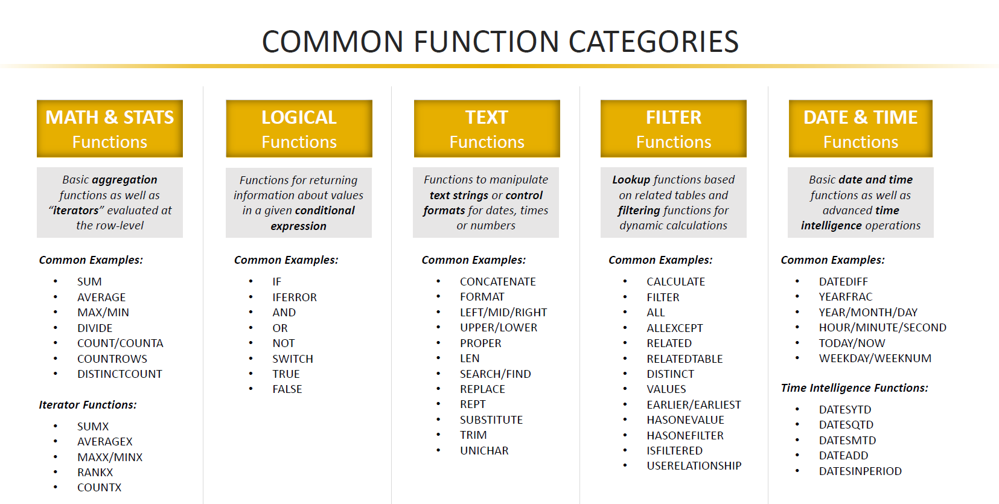

# DAX

> 1. Build normalized tables from the start
> 2. Organize lookup tables
> 3. Avoid two-way filtering
> 4. Hide fields that are foreign keys (not to be used in filter context)


## Calculated Columns

- It is most common use of DAX to create calculated columns, referencing to columns or table, NOT A1-style value
- It is useful to filtering data, rather than creating numerical calculation (aggregation)
- Values in calculated columns are calculated based on information from each row of a table (Row Context)

## Measures (Explicit)

- Explicit Measure values are **not visible** within tables as it does not create new data; they live on visuals (measure)
- They are **constantly evaluated** based on **filter context** (Filter on page or visuals)
- Implicit  measure on the other hand is plain measure from table where you can click through to assign measurement to like sum, average, etc.
- It is strongly **advised to use Explicit measure** even for a simple measure

It is advised to relocate calculated columns or measures according to the right scope (or select right table in the first place)

## Filter context

- When measure is calculated on the basis of filter context, it follows the steps:

  > 1. Filter is detected and applied
  > 2. Filter flow downstream to all related data tables
  > 3. Evaluate formula

## DAX Syntax

- A most common DAX syntax would look like below:

  ```dax
  {MEASURE NAME}: = {FUNCTION NAME}({TABLE NAME}[{COLUMN NAME}])
  Total Quantitiy: = SUM(Transactions[quantity])
  ```

- It is not compulsory, but for measure reference, `{TABLE NAME}` can be skipped and used alone

- Some of the operators are different from other languages such as:

  | Operator | Meaning                                      | Example                            |
  | -------- | -------------------------------------------- | ---------------------------------- |
  | `&`      | concatenates text                            | "+82" & [Number] & [Name]          |
  | `&&`     | AND condition                                | ([Name]="John") && ([age]<20)      |
  | `IN`     | OR condition given list (**curly brackets**) | [Name] IN {"John", "Tom", "Jerry"} |
  | `<>`     | Not equal to                                 |                                    |

- Some useful/basic functions are as follows;

  

## Related

- `RELATED()` returns related values in each row of a table based on relationship with other tables, almost like `vlookup()` **(ITERATION!)**
- `RELATED()` itself is best not to use, but the iteration concept is introduced hereby, and is useful in other functions like `FILTER()` or `SUMX()`

